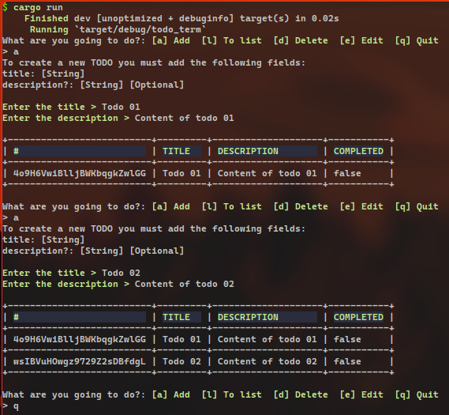

# Todo Term
Todo term is a simple terminal application for storing tasks.



## Installation
1. Clone the repository
```bash
git clone https://github.com/yoelvp/todo-term.git
```

2. Move to the project's root directory
```bash
mv todo-term
```

3. Run the program
```bash
cargo run
```

## Usage
You can use the application in a very easy and straightforward manner

| Keys       | Description          |
|------------|----------------------|
|<kbd>a</kbd>| Add a new TODO       |
|<kbd>l</kbd>| List all TODOS       |
|<kbd>e</kbd>| Edit a specific TODO |
|<kbd>d</kbd>| Delete a TODO        |
|<kbd>q</kbd>| Exit the program     |

## License
MIT [License](./LICENSE)
